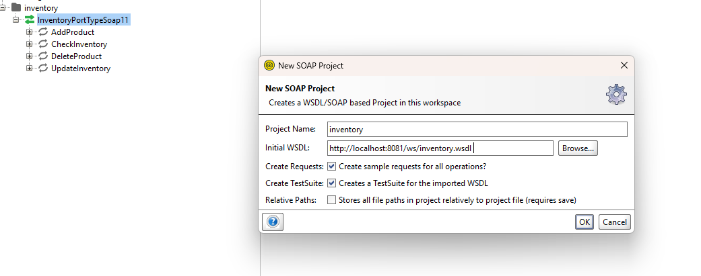

# Title Project:
SOAP WEB SERVICE with java 21 and spring boot 3.3.2

## Scenario Description:

Scenario: Inventory management


```bash
http://localhost:8081/ws/inventory.wsdl
```



# EJEMPLO


```xml
<soapenv:Envelope xmlns:soapenv="http://schemas.xmlsoap.org/soap/envelope/" xmlns:inv="http://example.com/inventory">
   <soapenv:Header/>
   <soapenv:Body>
      <inv:AddProductRequest>
         <inv:product>
            <inv:productId>?</inv:productId>
            <inv:name>?</inv:name>
            <inv:quantity>?</inv:quantity>
         </inv:product>
      </inv:AddProductRequest>
   </soapenv:Body>
</soapenv:Envelope>
```


